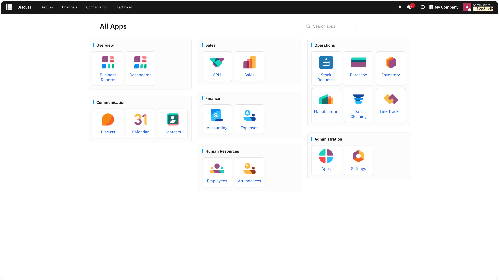
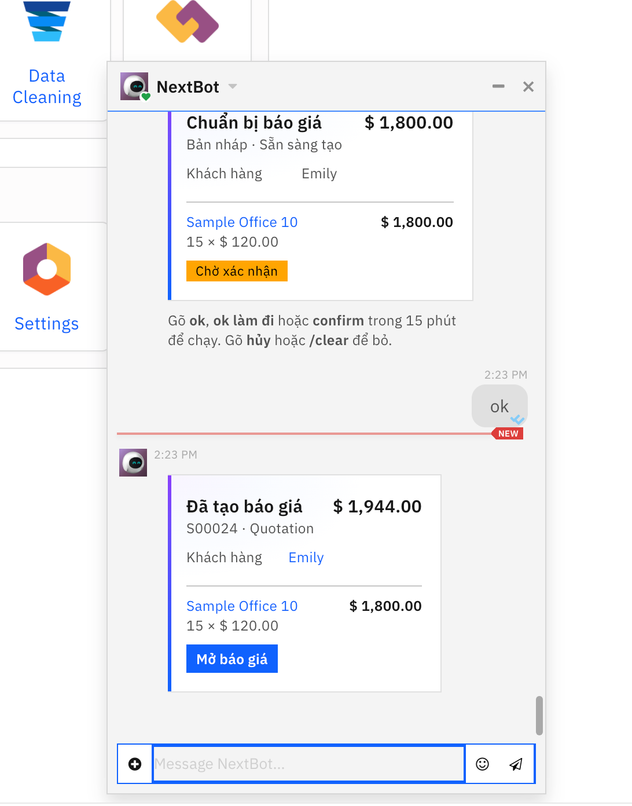
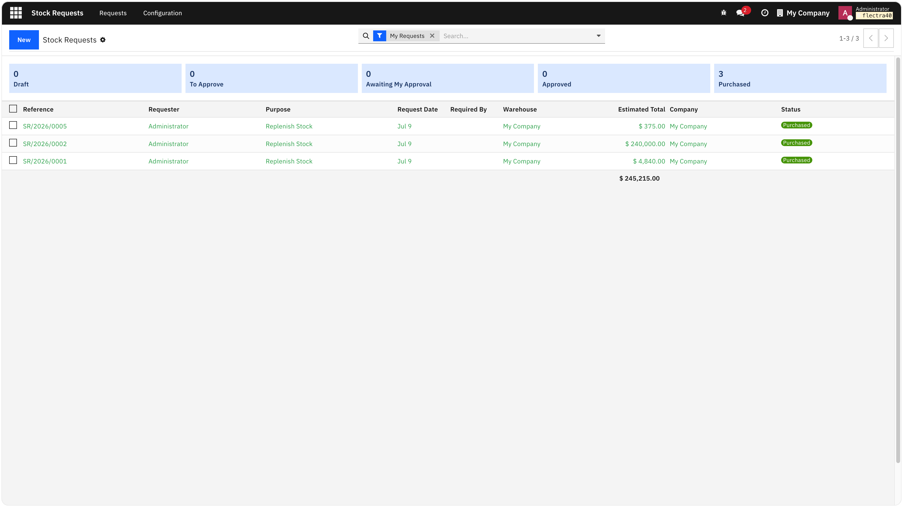
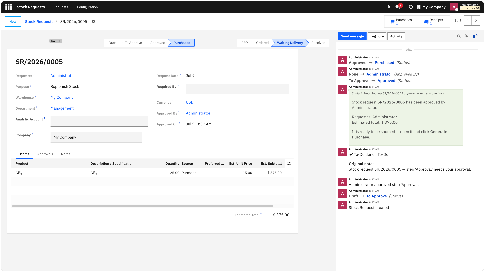

# NextOSP

[](https://github.com/NextOSP/nwos/actions/workflows/ci.yml)

NextOSP is an open-source ERP and CRM platform for running business applications
from one modular server. It includes apps for accounting, inventory, sales,
purchasing, projects, marketing, help desk, point of sale, websites, and more.

The platform is built around a Python server, PostgreSQL database, web client,
module system, report engine, background jobs, and HTTP/XML-RPC integration
interfaces.

NextOSP is a fork of [Flectra](https://gitlab.com/flectra-hq/flectra), which is
itself a fork of [Odoo Community Edition](https://github.com/odoo/odoo). See
[Credits](#credits) for details.



## Highlights

### NextBot — get work done by chatting

NextBot lives in Discuss and turns plain-language requests into real business
records. Ask it to prepare a quotation and it drafts one, waits for your
confirmation (`ok`, `confirm`, or `/clear` to cancel), then creates the sales
order and links straight back to it — no form-hopping required.



### Stock Requests — request, approve, purchase

Internal users request items for stock, office, project, or manufacturing.
Each request flows through **Draft → To Approve → Approved → Purchased**, with a
configurable self-approval threshold. Once approved, a buyer clicks *Generate
Purchase* and every line is routed through the product's own routes
(Buy / Manufacture / Transfer), feeding replenishment and RFQs automatically.



The request form tracks the full approval and purchasing history in the chatter,
and surfaces the linked purchases and receipts right from the header.



### IBM Carbon Design throughout

The backend and frontend are themed with the
[IBM Carbon Design System](https://carbondesignsystem.com/), giving NextOSP a
clean, consistent, enterprise-grade look. Spreadsheet dashboards are rendered in
Carbon style with [`@carbon/charts`](https://charts.carbondesignsystem.com/),
so KPIs and reports match the rest of the interface out of the box.

## Documentation

| Guide | What it covers |
| --- | --- |
| **[INSTALLATION.md](INSTALLATION.md)** | Install on Ubuntu/Debian — local development and production (dedicated user, systemd, nginx + TLS), plus troubleshooting |
| [docs/deployment.md](docs/deployment.md) | Docker, Docker Compose, and Kubernetes deployment, worker sizing, backups, and upgrades |
| [CONTRIBUTING.md](CONTRIBUTING.md) | Pull request guidelines |
| [SECURITY.md](SECURITY.md) | Reporting security issues |

## Quickstart (local development)

Requires Python 3.10+, PostgreSQL 13+, and `wkhtmltopdf`. For system packages,
production, and containers, see **[INSTALLATION.md](INSTALLATION.md)**.

```bash
# 1. Clone and enter the project
git clone https://github.com/NextOSP/nwos.git
cd nwos

# 2. Python virtual environment
python3 -m venv venv
source venv/bin/activate
pip install --upgrade pip wheel setuptools
pip install -r requirements.txt

# 3. PostgreSQL role that can create databases
sudo -u postgres createuser --createdb --pwprompt nwos
```

Create `nwos.local.conf` (machine-specific; do not commit real passwords):

```ini
[options]
addons_path = addons,nwos/addons
data_dir    = data
db_host     = localhost
db_port     = 5432
db_user     = nwos
db_password = change-me
db_name     = nwos
http_port   = 8069
logfile     = logs/nwos.log
```

Initialize the database, then start the server:

```bash
./nwos-bin server -c nwos.local.conf -i base --stop-after-init
./nwos-bin server -c nwos.local.conf
```

Open <http://localhost:8069> and log in (default `admin` / `admin` on a fresh
database). Install business apps at any time:

```bash
./nwos-bin server -c nwos.local.conf -i sale,stock,purchase,account
```

## Container Deployment

Run PostgreSQL, web, and cron together with Docker Compose, then open
<http://localhost:7073>:

```bash
docker compose up --build
docker compose run --rm web server -c /etc/nwos/nwos.conf -d nwos -i base --stop-after-init
```

Production-oriented Kubernetes manifests live in [`k8s/`](k8s/) (web/cron
Deployments, PostgreSQL, Ingress, and backup/restore Jobs). See
**[INSTALLATION.md](INSTALLATION.md)** for the Docker, Kubernetes, and
**backup & restore** procedures, and [docs/deployment.md](docs/deployment.md)
for the full deployment reference (worker sizing, topology, upgrades).

## Common Development Tasks

Install or update modules in a database:

```bash
./nwos-bin server --addons-path=addons,nwos/addons -d nwos -i sale,stock
./nwos-bin server --addons-path=addons,nwos/addons -d nwos -u sale,stock
```

Run with developer reload helpers:

```bash
./nwos-bin server --addons-path=addons,nwos/addons -d nwos --dev=reload,qweb,xml
```

Create a new addon skeleton:

```bash
./nwos-bin scaffold my_module addons
```

List available commands:

```bash
./nwos-bin --help
```

## Testing

Run tests for installed modules:

```bash
./nwos-bin server --addons-path=addons,nwos/addons -d nwos_test --test-enable
```

Run a targeted test selection:

```bash
./nwos-bin server --addons-path=addons,nwos/addons -d nwos_test --test-tags /account
```

Both `--test-enable` and `--test-tags` imply `--stop-after-init`.

## Repository Layout

- `nwos/`: core server, ORM, services, tools, and CLI commands
- `nwos/addons/`: server-wide and core technical addons
- `addons/`: business and application addons
- `setup/`: packaging and service entry points
- `doc/`: contributor and legal documentation
- `migration/`: migration planning and support material

## Contributing

See [CONTRIBUTING.md](CONTRIBUTING.md) for pull request guidelines.

Security issues should be reported privately as described in
[SECURITY.md](SECURITY.md).

## Credits

NextOSP builds on the work of the open-source ERP community:

- [Odoo Community Edition](https://github.com/odoo/odoo) — the original
  open-source ERP/CRM platform on which this lineage is based.
- [Flectra](https://gitlab.com/flectra-hq/flectra) — the community fork of Odoo
  Community Edition that NextOSP is derived from.
- [IBM Carbon Design System](https://carbondesignsystem.com/) and
  [`@carbon/charts`](https://charts.carbondesignsystem.com/) — the design system
  and charting library behind the NextOSP theme and dashboards.

NextOSP is an independent project and is not affiliated with, sponsored by, or
endorsed by Odoo S.A. or the Flectra project. "Odoo" and "Flectra" are the
trademarks of their respective owners.

## License

NextOSP is distributed under the LGPL-3 license. See [LICENSE](LICENSE) for the
full license text.
